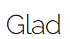

# 🐍 Snake Game

**Classic Snake game coded entirely from scratch in C++ using OpenGL, GLFW, and GLAD.**  
All game logic, rendering, and input handling are implemented manually, without using any game engines. A pure graphics programming and game logic exercise!

---

## 🛠️ Tech Stack

| C++ | OpenGL | GLFW | GLAD | VisualStudio |
|:---:|:-----:|:----:|:----:|:-----------:|
|  |  |  |  |  |

---

## 🎮 Gameplay Demo

<video width="600" controls>
  <source src="media/snake_demo.mp4" type="video/mp4">
  Your browser does not support the video tag.
</video>

https://github.com/user-attachments/assets/ebe2040e-aad2-4087-a197-103913428625

